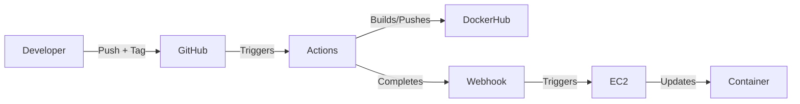

# Continuous Deployment Project

## Project Overview

**Goal:** Automate deployment of Docker containers to AWS EC2 when code is pushed to GitHub.

**Tools:**
- **AWS EC2** - Production server
- **Docker** - Runs containerized application
- **Bash Script** - Automates container updates
- **webhook** - Listens for GitHub notifications
- **GitHub Webhooks** - Triggers deployments

**Diagram:**



---

## Part 1: EC2 Instance & Deployment Script

### EC2 Instance Details

**AMI:** Ubuntu Server 24.04 LTS  
**Instance Type:** t2.medium  
**Storage:** 30 GB  

**Security Group:**

| Port | Source    | Purpose           |
|------|-----------|-------------------|
| 22   | Your IP   | SSH access        |
| 80   | 0.0.0.0/0 | Web traffic       |
| 9000 | 0.0.0.0/0 | Webhook listener  |

**Justification:** Port 22 restricted for security. Port 80 open for public web access. Port 9000 open for GitHub webhooks (dynamic IPs).

### Docker Installation

```bash
sudo apt update
sudo apt install -y docker.io
sudo systemctl enable docker
sudo systemctl start docker
sudo usermod -aG docker ubuntu
```

**Verify:**
```bash
docker --version
docker ps
```

### Testing Container

```bash
# Pull image
docker pull wesleymorah/cicdf25-wesleymorah:latest

# Run container
docker run -d -p 80:80 --name myapp wesleymorah/cicdf25-wesleymorah:latest

# Verify
docker ps
curl localhost
```

**Flag differences:**
- `-d` = Detached (background) - recommended for production
- `-it` = Interactive (foreground) - for testing only

### Deployment Script

[Link to refresh.sh](deployment/refresh.sh)

**What it does:**
1. Stops old container
2. Pulls latest image from DockerHub
3. Starts new container

**Testing:**
```bash
chmod +x /home/ubuntu/refresh.sh
/home/ubuntu/refresh.sh
docker ps
```

---

## Part 2: Webhook Listener

### Installation

```bash
sudo apt install -y webhook
webhook -version
```

### Hook Definition

[Link to hooks.json](deployment/hooks.json)

**Summary:** Defines webhook endpoint that validates GitHub signature and triggers refresh script.

**Verify loaded:**
```bash
webhook -hooks /home/ubuntu/hooks.json -verbose -port 9000
# Should show: "loaded: redeploy-app"
```

### Monitoring

**Check logs:**
```bash
sudo journalctl -u webhook -f
```

**Look for:**
- "hook triggered successfully"
- "executing /home/ubuntu/refresh.sh"

**Docker process:**
```bash
docker ps
docker images | grep wesleymorah
```

### Webhook Service

[Link to webhook.service](deployment/webhook.service)

**Summary:** Systemd service that starts webhook on boot, runs on port 9000, automatically restarts if crashed.

**Enable and start:**
```bash
sudo systemctl daemon-reload
sudo systemctl enable webhook
sudo systemctl start webhook
sudo systemctl status webhook
```

**Verify running:**
```bash
# Check logs
sudo journalctl -u webhook -n 50

# Should see webhook triggered and container refreshed
```

---

## Part 3: GitHub Webhook

### Sender Selection

**Using GitHub** because:
- Triggers immediately when workflow completes
- Reliable integration with GitHub Actions
- Validates payloads with shared secrets

### Configuration

**GitHub Settings → Webhooks → Add webhook:**

- **Payload URL:** `http://YOUR_EC2_IP:9000/hooks/redeploy-app`
- **Content type:** `application/json`
- **Secret:** (same secret from hooks.json)
- **Events:** Workflow runs
- **Active:** ✓

### Trigger Events

Webhook sends payload when:
- GitHub Actions workflow completes
- Triggered after pushing a tag

### Verification

**GitHub:**
- Settings → Webhooks → Recent Deliveries
- Green checkmark = Success

**EC2:**
```bash
sudo journalctl -u webhook -n 50
# Look for: "hook triggered successfully"
```

### Security Validation

**How it works:**
- GitHub signs payload with secret (HMAC-SHA256)
- Webhook verifies signature
- Only valid signatures trigger deployment

**Test:**
```bash
# Without signature (should fail)
curl -X POST http://YOUR_EC2_IP:9000/hooks/redeploy-app
# Returns: "Hook rules were not satisfied"
```

---

## Resources

- **Docker on Ubuntu** - https://docs.docker.com/engine/install/ubuntu/
- **adnanh's webhook** - https://github.com/adnanh/webhook
- **GitHub Webhooks** - https://docs.github.com/en/webhooks
- **Systemd Services** - https://linuxhandbook.com/create-systemd-services/
