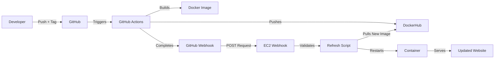
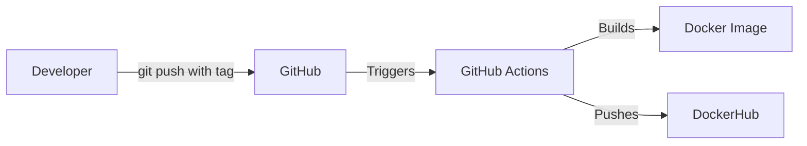

# Continuous Integration & Deployment Pipeline

## Continuous Deployment Project Overview

**Goal:** Automatically deploy updated Docker containers to AWS EC2 when new code is pushed to GitHub.

**Tools and Roles:**
- **GitHub Actions** - Builds and pushes Docker images when tags are pushed
- **DockerHub** - Stores container images with semantic version tags
- **GitHub Webhooks** - Notifies EC2 when deployment is ready
- **AWS EC2** - Production server running the application
- **webhook (adnanh)** - Listens for GitHub notifications on EC2
- **Bash Script** - Automates pulling new images and restarting containers
- **Docker** - Runs containerized web application

**Deployment Diagram:**



**Status:** All components working. EC2 IP changes when AWS Lab restarts - requires updating GitHub webhook URL.

---
# Continuous Integration Project

## Project Overview

This project automates building and publishing Docker container images using GitHub Actions. When code is pushed with a semantic version tag, the workflow automatically builds the image and pushes it to DockerHub with appropriate version tags.

**Tools:**
- Docker - Containerization
- GitHub Actions - CI/CD automation
- DockerHub - Container registry

**Diagram:**



---

## Part 1: Dockerfile & Building Images

### Website Content
- Location: `/web-content` folder
- Files: index.html, [other].html, styles.css
- [Dockerfile](web-content/Dockerfile)

### Building the Image
```bash
docker buildx build --platform linux/amd64 -t USERNAME/REPONAME:latest --push ./web-content/
```

### Running a Container
```bash
docker run -d -p 8080:80 USERNAME/REPONAME:latest
```

---

## Part 2: GitHub Actions Workflow

### DockerHub Authentication
1. Create PAT: DockerHub → Settings → Security → New Access Token
2. Scope: Read, Write, Delete
3. Add secrets in GitHub: Settings → Secrets → Actions
   - `DOCKER_USERNAME`: DockerHub username
   - `DOCKER_TOKEN`: PAT

### Workflow Details
- **Trigger:** Push to `main` branch
- **Steps:** Checkout → Setup Buildx → Login → Build/Push
- [Workflow file](.github/workflows/docker-build.yml)

### Testing
- Push to `main` branch
- Check Actions tab for workflow run
- Verify image on [DockerHub](https://hub.docker.com/r/wesleymorah/ceg3120f25-wesleymorah)

---

## Part 3: Semantic Versioning

### Creating Tags
```bash
# View tags
git tag

# Create tag
git tag -a v1.0.0 -m "Release message"

# Push tag
git push origin v1.0.0
```

### Workflow Modifications
- **Trigger:** Tag push matching `v*.*.*`
- **Metadata Action:** Generates version tags automatically
- Creates tags: `latest`, `MAJOR`, `MAJOR.MINOR`

[Workflow file](.github/workflows/docker-build.yml)

### Testing
- Create and push a tag
- Check Actions tab
- Verify multiple tags on [DockerHub](https://hub.docker.com/r/wesleymorah/ceg3120f25-wesleymorah)

---

## Resources

- Docker Documentation - https://docs.docker.com
- GitHub Actions - https://docs.github.com/en/actions
- Semantic Versioning - https://semver.org
Fix secret name
