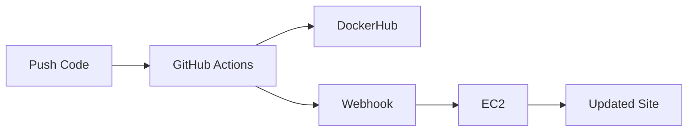

# CI/CD Pipeline Project

## Project Summary

Complete CI/CD pipeline that automates building Docker images and deploying them to AWS EC2.

## Documentation

- **[README-CI.md](README-CI.md)** - Continuous Integration
  - Docker image building
  - GitHub Actions workflows
  - Semantic versioning with git tags
  
- **[README-CD.md](README-CD.md)** - Continuous Deployment
  - EC2 instance setup
  - Deployment automation
  - Webhook configuration

## Repository Structure

```
.
├── README.md
├── README-CI.md
├── README-CD.md
├── .github/workflows/docker-build.yml
├── web-content/
│   ├── Dockerfile
│   ├── index.html
│   └── styles.css
└── deployment/
    ├── refresh.sh
    ├── hooks.json
    └── webhook.service
```

## How It Works



**Process:**
1. Push tagged code to GitHub
2. GitHub Actions builds and pushes Docker image
3. GitHub sends webhook to EC2
4. EC2 pulls new image and restarts container
5. Website updated automatically
